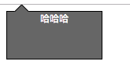

##### 浏览器前缀的由来
许多css属性前面都会加上`-webkit-`或者`-moz-`，`-o-`之类的前缀。这是因为有些css属性还是属于实验性特征还不属于正式规范的一部分，为了给工作组反馈，浏览器厂商会考虑先实现一部分在浏览器里加上前缀给开发者使用。结果开发者发现，这些有了前缀的特性能轻易的实现以前需要大费周折所实现的效果，所以，这些特性就被滥用。后来发现只写出当前适用的新特性时，还需要时不时回来打补丁，后来干脆将所有可能的浏览器前缀添加上去变成：
```
-moz-border-radius: 10px;
-ms-border-radius: 10px;
-o-border-radius: 10px;
-webkit-border-radius: 10px;
border-radius: 10px;
```
当然，随着各种预处理器的流行，这些兼容性的前缀现在都可以在编译的时候自动添加。

##### CSS编码技巧
css也是一种开发语言，为了提高代码的可维护性，保持代码的DRY（DON'T REPEAT YOURSELF）是最大的挑战之一。平时写css代码的时候可能会出现一些复制粘贴的情景，或者两段差不多的css只是某几行有一点点修改，或者属性值大量使用绝对值，而不是通过相对的关系来确定。最简单的例如字体，用em表示，`·line-height`与字体相关等。所以我们需要审视到底哪些效果是需要动态的变化的，哪一些又是固定不变的。
```css
/* 方法一 */
border-width: 10px 10px 10px 0; 
/* 方法二 */
border-width: 10px;
border-left-width: 0;
```
上面这段定义border宽度的代码，按照第一种写法如果将10px改成15px，那么要改3个地方。第二种写法只需要改一个地方，明显容易一些。

**定义一个按钮的样式代码**
```
padding: 6px 16px;
border: 1px solid #446d88;
background: #58a linear-gradient(#77a0bb, #58a);
border-radius: 4px;
box-shadow: 0 1px 5px gray;
color: #fff;
text-shadow: 0 -1px #335166;
font-size: 20px;
line-height: 30px;
background: #666;
```
这个代码有很多可以改进的空间，比如`line-height`属性，如果调整了字号，那么line-height也要随之更改。实际上，这里行高的高度就是字号的1.5倍。那么line-height可以写为1.5，提高了维护性。
上面的代码使用了一个不怎么灵活的单位**px**。如果修改了这个按钮里的字号，边框，内边距属性并没有随着字号的调整灵活伸缩，就会很不协调。
一个解决方法就是使用em单位或者rem单位，他们每个单位的长度都会根据上级元素的字体大小来动态变化。区别在于em参考的是父级font-size大小，而rem参考的是html标签的font-size大小。

<!-- more -->

```css
html {
    font-size: 10px; /*1rem就是10px，需要15px换算为rem单位1.5rem简单除以10即可*/
    /*这样写需要注意的是浏览器最小字号是12px，小于12px的字体大小仍然以12px显示。但是以这个为基准单位的rem不影响计算结果。*/
}
body button{
    padding: 0.6rem 1.6rem;
    border: 0.1rem solid #446d88;
    background: #58a linear-gradient(#77a0bb, #58a);
    border-radius: 0.4rem;
    box-shadow: 0 0.1rem 0.5rem gray;
    color: #fff;
    text-shadow: 0 -0.1rem #335166;
    font-size: 2rem;
    line-height: 30px;
    background: #666;
}
```
需要缩放，修改html的字号即可。如果不指定html的font-size，那么默认就是16px（所有浏览器都是这样）。

**currentColor**
这个值是CSS中有史以来的第一个变量，很多属性，例如border-color、outline-color等的初始值就是这个，它自动从文本获得颜色。
**继承inherit**
大多数人知道inherit这个关键字，但很容易遗忘。inherit可以用在任何CSS属性中，而且他还总是绑定到父元素的计算值，对于伪元素来说则会取得生成该伪元素的宿主元素。
一个简单气泡样式：


```css
html {
    font-size: 10px; 
}
body .bubble{
    width: 10rem;
    height: 5rem;
    background: #666;
    color: #fff;
    text-align: center;
    border: 1px solid #000;  
    position: relative;
}
body .bubble::before {
    position: absolute;
    content: "";
    padding: 0.5rem;
    background: inherit; /*继承宿主元素背景色*/
    border: inherit; /*继承宿主元素边框样式*/
    border-right: 0;
    border-bottom: 0;
    top: -0.6rem;
    left: 1rem;
    transform: rotate(45deg);
}
```

**关于响应式网页设计**
* 媒体查询的端点不应该由具体的设备来决定。
* 使用百分比长度来取代固定长度。或于是口相关的单位（vw、vh、vmin和vmax）。
* 需要在较大设备获得固定宽度，使用max-width而不是width,前者可以使用较小的分辨率。
* 为替换元素(img、objuct、video、iframe等)设置一个max-width。
* 背景图片background-size: cover可以铺满，但大图缩小带宽会消耗。
* 图片或其他元素行列式布局时，display: inline-block或flexbox来布局。
* 多列文本，指定column-width（列宽）而不是指定column-count（列数）。

**媒体查询不应该写的太多，大多数都是实现根据屏幕宽度2列变1列这样功能的代码，写太多得考虑一下css是否合理了**

**合理使用简写**
```css
background: rebeccapurple;
background-color: rebeccapurple
```
background属性只设置一个表示把背景设定为rebeccapurple纯色，它是4个属性的缩写，但是如果只指定background-color属性，这个时候如果有background-image属性那么只会显示背景图片而不是纯色背景了。