### 半透明边框 ###
http://play.csssecrets.io/translucent-borders

如果纯粹这么定义半透明边框
```
border: 10px solid hsla(0,0%,100%,.5);
background: white;
```
会出现问题：
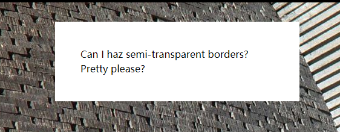
半透明边框被白色覆盖了，这是因为background的区域会延伸到边框区域，从而导致半透明效果覆盖在白色上而不是后面的背景上。
边框是真实存在的，如果改成相同透明度红色，可以看到显示的是半透明的红色加上白色的边框颜色：
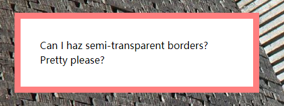
为了不让背景延伸到边框区域，加上`background-clip: padding-box;`属性
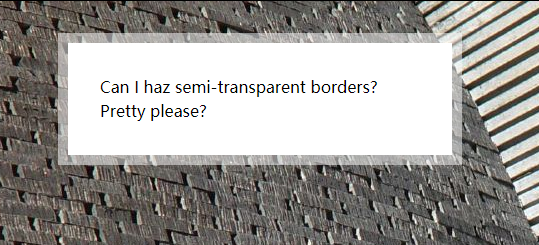
就正常了。

### 多重边框 ###
正常使用边框可以使用border属性，但是border只能有一层边框。`box-shadow`可以使用逗号分隔语法创建任意数量投影，从而达到多重边框效果。
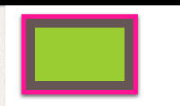
```
width: 100px;
height: 60px;
margin: 25px;
background: yellowgreen;
box-shadow: 0 0 0 10px #655,
          0 0 0 15px deeppink,
          0 2px 5px 15px rgba(0,0,0,.6);
```
如果只是两层边框，还可以使用border加上outline属性。outline属性会在div外面套上一层边框（描边），不影响原来元素的宽度长度。
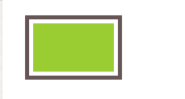
```
border: 5px solid #fff;
outline: 5px solid #655;
```
缺点：

只适用于双层边框。
边框不一定贴合border-radius产生的圆角。
尽管说描边可以不是矩形，但大多数情况需要测试。

### 灵活的背景定位 ###
http://dabblet.com/gist/0f226e63595d1bef88cb
>很多时候，我们想针对容器的某个角对背景图案做偏移定位,例如想要类似内边距的效果怎么做呢。

```
background: url(http://csssecrets.io/images/code-pirate.svg)
	            no-repeat bottom right #58a;
background-position: right 20px bottom 10px;
```
background属性里的bottom right是一种回退方案，万一`background-position`不被支持图片位置不至于太奇怪。
还有一种更灵活的根据盒模型来定位图片的position，`background-origin`属性
http://play.csssecrets.io/background-origin
```
background: url(http://csssecrets.io/images/code-pirate.svg)
	            no-repeat bottom right #58a;
background-origin: content-box;
```
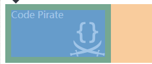
蓝色部分就是content-box区域，设置`background-origin: content-box`将会使图片贴着content-box的右下角，无需写死距离。
也可以使用calc计算相对位置：
```
background: url(...) no-repeat;
background-position: calc(100% - 20px) calc(100% - 10px)
```
### 边框内圆角 ###
http://play.csssecrets.io/inner-rounding
如果需要实现一个效果，边框内侧为圆角，边框外侧仍保持矩形，并且不能用两个div元素来实现。可以使用`outline`加上`box-shadow`配合实现完成。
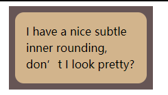
```
outline: .6em solid #655;
box-shadow: 0 0 0 .4em #655; /* todo calculate max of this */

max-width: 10em;
border-radius: .8em;
padding: 1em;
margin: 1em;
background: tan;
font: 100%/1.5 sans-serif;
```
使用outline属性在div最外层套一圈棕色的边框，这个时候圆角周围会留白。此时可以由border-radius的半径计算出直角到圆心的半径再减去圆的半径即可。
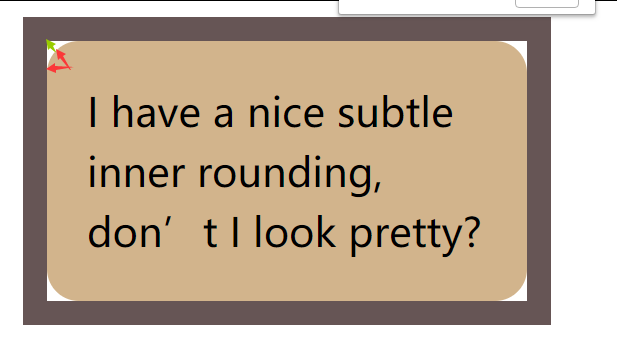
红色箭头是border-radius的值，绿色是需要用box-shadow填充的距离，红色箭头加绿色箭头的长度可以由勾股定理得出。
### 条纹背景 ###
http://play.csssecrets.io/horizontal-stripes
* 水平条纹
用css产生条纹背景，使用`background-size`属性和`linear-gradient`。
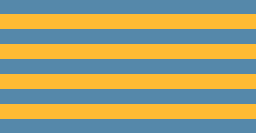
```
background: linear-gradient(#fb3 50%, #58a 0);
background-size: 100% 30px; /*默认背景自动repeat的*/
```
`linear-gradient`后面的百分比意思是分别设置#AAA颜色直到xx%位置和设置#BBB颜色从xx%位置开始，中间的区域即为过渡区域。
如果要设置条纹效果，那么就是两个颜色之间没有过渡效果，只需要把两个颜色的色标位置设置为相同即可。如果把第二个色标的位置设置为0，那么它的位置就总是被浏览器调整为前一个色标的位置。
* 垂直条纹
`linear-gradient`可以接受一个角度参数，旋转90度即可。
```
linear-gradient(to right, /* 或 90deg*/ #fb3 50%, #58a 0);
background-size: 30px 100%;
```
 * 斜向条纹
 如果直接转45度，实际上只是把每个重复单元内部的渐变旋转了45度：
 ```
background: linear-gradient(45deg, #fb3 50%, #58a 0);
background-size: 100% 50px;
 ```
 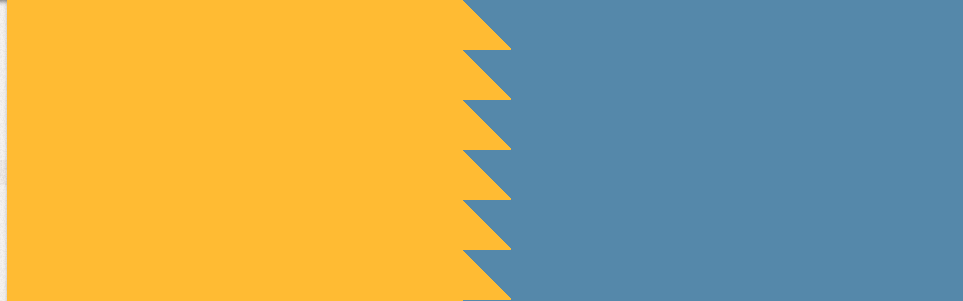
为了达到旋转的效果，需要实现这样的贴片：
	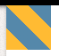
	实际上就是需要包含4条条纹，每隔25%变换一下颜色，最后旋转45度。
	```
background: linear-gradient(45deg, #fb3 25%, #58a 0, #58a 50%, #fb3 0, #fb3 75%, #58a 0);
background-size: 42px 42px;
	```
	最后效果：
	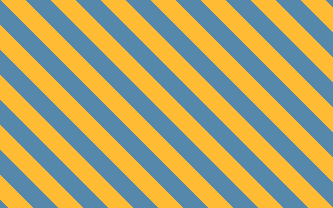
	使用`background: repeating-linear-gradient(45deg, #fb3, #fb3 15px, #58a 0, #58a 30px);`可以达到相同效果，色标会无限重复循环直到填满整个背景。
	
