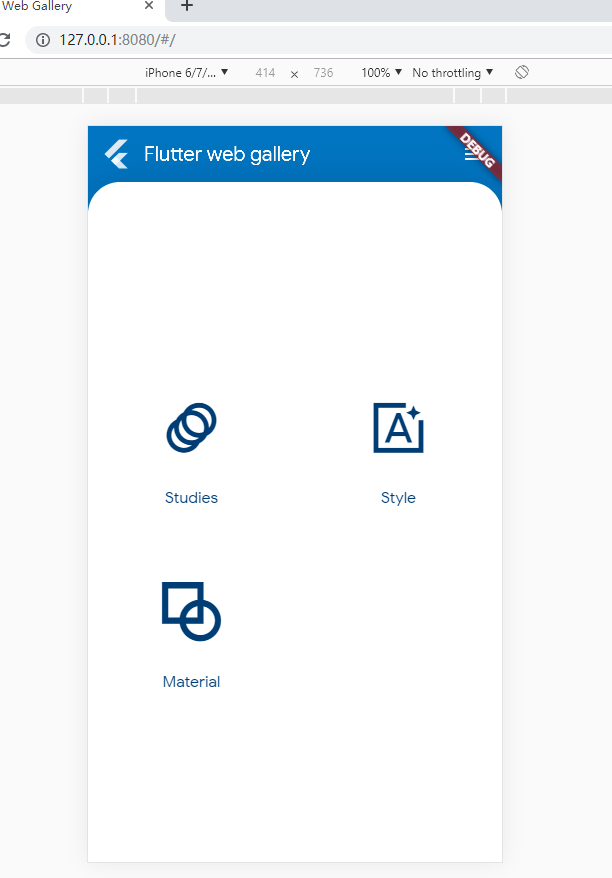
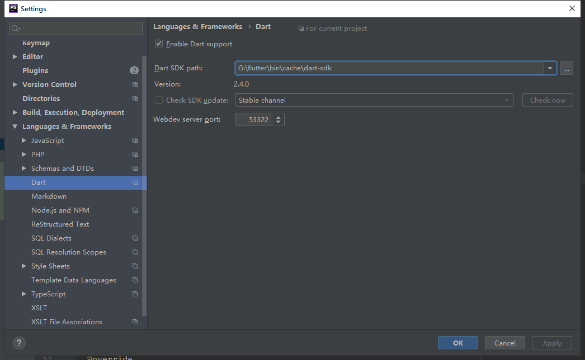

### 安装Flutter sdk ###
* 下载 https://storage.googleapis.com/flutter_infra/releases/stable/windows/flutter_windows_v1.7.8+hotfix.4-stable.zip
* 解压到一个文件夹，比如flutter
* 环境变量PATH添加`\flutter\bin`，这样就可以在命令行里面使用flutter命令
* 添加flutter国内镜像环境变量：FLUTTER_STORAGE_BASE_URL: https://storage.flutter-io.cn和PUB_HOSTED_URL：https://pub.flutter-io.cn
* 运行`flutter pub global activate webdev`下载安装web套件
* 添加`\flutter\.pub-cache\bin`到环境变量
* 添加dart sdk `\flutter\bin\cache\dart-sdk\bin`到环境变量

<!-- more -->

### 测试运行demo ###
*  clone flutter_web项目：`git clone https://github.com/flutter/flutter_web.git`
*  在这个项目里有若干个demo在examples文件夹里，里面有**Flutter Gallery**在web上的实现。
*  cd到`examples/gallery`，运行`pub get`安装依赖
*  依赖安装完成后，可以运行`webdev serve`开启一个服务运行demo，如果不只是想监听本地，可以运行`webdev serve --hostname 0.0.0.0`

这样就成功运行啦

### IDE配置 ###
我用的是idea全家桶，安装一下dart插件就可以了，安装完以后配置一下sdk目录：

