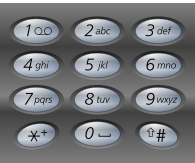
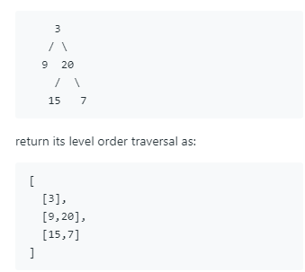

#### Container With Most Water


给定 n 个非负整数 a1,a2,...,an，其中每个代表一个点坐标（i,ai）。

n 个垂直线段例如线段的两个端点在（i,ai）和（i,0）。

找到两个线段，与 x 轴形成一个容器，使其包含最多的水。

备注：你不必倾倒容器。

一开始做法是从高到底排个序把最高的和第二高的柱子的面积乘一下即可，实际上是不对的，如果是[8,6,7]这样的情况会变成计算6x1的面积，实际上最大面积是7x2...

再次观察这个算最大面积实际上就是求min(i1, i2)*(a1-a2)的最大值。要算出这个高度，必然是两个柱子x两个柱子之间的距离。如何求最大值呢。首先两个柱子距离肯定是越大越好，但是两头的柱子高度无法保证是最高的，那么此时就要想办法在缩短距离的时候尽可能提高柱子的高度。分别用两个指针变量保存前面一个柱子和后面一个柱子的位置。并且初始化一个变量存结果最大值。当左边的高度小于右边的高度左指针往右走，当右边的高度小于左边的高度右指针往左走，这个过程中乘以距离算出面积。在两个指针相互逼近的时候一定会经过最大值，此时返回最大值即可。
```javascript
var maxArea = function(heights) {
    // 左右两个指针，分别往中间扫描，不断使两边的高度相互靠近，在这过程中一定会扫描到最大的结果面积
    let left = 0;
    let right = heights.length - 1;
    let max = 0;
    while (right > left) {
        max = Math.max(max, Math.min(heights[left], heights[right]) * (right - left));
        if (heights[left] < heights[right]) {
            left ++;
        } else {
            right --;
        }
    }
    return max;
};
```

#### 2.Add Two Numbers 大数相加

 * Input: (2 -> 4 -> 3) + (5 -> 6 -> 4)
 * Output: 7 -> 0 -> 8
 * Explanation: 342 + 465 = 807.
 
 第一次写法直接想到先把链表转成数字，然后相加再拆回链表。提交的时候大部分case可以过，然而一旦链表超出31位js就会因为精度问题溢出变成科学计数法相加结果就不对了。

 ```javascript
 var addTwoNumbers = function(l1, l2) {
    function getNumber(linkedList) {
        let numberArr = [];
        for (let currentLink = linkedList; ; currentLink = currentLink.next) {
            numberArr.push(currentLink.val);
            if (!currentLink.next) break;
        }
        return new Number(numberArr.reverse().join(''));
    }
    let strNumber = (getNumber(l1) + getNumber(l2)).toString();
    let digits = [...strNumber];
    digits = digits.reverse();
    let rsLinkedList = {
        val: digits[0]
    };
    let head = rsLinkedList;
    for (let i = 1; i < digits.length; i++) {
        head.next = {
            val: digits[i]
        }
        head = head.next;
    }
    return rsLinkedList;
};
 ```

 正确的做法是每个链表按位相加添加到新链表节点上，并且设置进位，如果进位是1的时候强制添加一个新的链表节点。（比如5+5结果10，需要两个链表节点）

 ```javascript
 var addTwoNumbers = function(l1, l2) {
    let head1 = l1;
    let head2 = l2;
    let head3 = new ListNode(0);
    let rsHead = head3;
    let carry = 0; // 进位标识，0或者1
    while(head1 || head2) {
        if (head1) {
            carry += head1.val;
            head1 = head1.next;
        }
        if (head2) {
            carry += head2.val;
            head2 = head2.next;
        }
        head3.val = carry % 10;
        carry = parseInt(carry / 10);
        if (head1 || head2) {
            head3.next = new ListNode(carry);
            head3 = head3.next;
        }   
    }
    // 如果最后一次相加需要进位，新增一个节点
    if (carry === 1) {
        head3.next = new ListNode(carry);
    }
    return rsHead;
};
 ```
 
#### 3.最长回文子串

经典题目，求一个字符串里面最长的回文，babad里的bab或者cbbd里面的bb。写了两个解法，第一个是使用动态规划，第二个是马拉车算法。
	  **动态规划**
	动态规划解法的思想是从长度1开始增量，判断内部的字串是不是回文并且保存在一个二维数组里。举例来说，判断abba，增量是1的时候，abba每个字符都是回文，增量从2开始的时候，先判断他们的首尾，首位相等的时候再判断里面的部分是否是回文。因为里面的部分即当前增量-1已经判断过了，所以直接读取结果即可。abba这个例子当增量是4的时候，即判断abba是否回文，因为头部a和尾部a相等，所以判断bb是否回文。bb是否回文已经在增量是2的时候判断过并且是真，所以abba也是回文。

```javascript
var longestPalindrome = function(s) {
    let str = s.split('');
    let dp = new Array(str.length);
    let rsStrPos = 0;
    let maxLen = 0
    for (let i = 0;i < dp.length; i++) {
        dp[i] = new Array(str.length);
    }
    // sLen是判断回文的增量（长度0和1一定是回文，2如果两边相等那么也是回文）
    for (let sLen = 0; sLen <= str.length; sLen++) {
         for (let charIndex = 0; charIndex < str.length; charIndex++) {
            if (sLen === 0 || sLen === 1) {
                dp[charIndex][sLen] = true;
            }
            // 头尾相等，判断中间是否已经存在过判断回文的结果
            else if (str[charIndex] === str[charIndex + sLen - 1]) {
                // abba这种情况，当前增量是4，需要判断bb这个字符串起点当前+1，当前增量-2的情况
                dp[charIndex][sLen] = dp[charIndex + 1][sLen - 2];
            }
            else {
                dp[charIndex][sLen] = false;
            }
            if (dp[charIndex][sLen] && sLen > maxLen) {
                // 记录回文最大值位置
                maxLen = sLen;
                rsStrPos = charIndex;
            }
         }
    }
    return s.substr(rsStrPos, maxLen);
};
```

**马拉车算法**
这个算法比较难，也是一部分动态规划的思想。有待整理


#### 3Sum

2Sum的升级版，需要列出数组中三个数相加为0的所有情况。解题方法是可以先固定数组中的一个数字，这样就可以变成2sum的问题。直接固定一个数字并且套用2sum那种hashmap的办法会有重复结果出现，并且做去重处理会超时。再次观察其实就是求固定的那个数字的相反数，如果把数组给排序了，并且用两个指针使用互相逼近的方法去找三者和为0的情况，那么就可以以线性复杂度找到三个数字。
```javascript
var threeSum = function(nums) {
  // 排序后双指针找target相加为0即可。
  nums = nums.sort((a, b) => a - b);
  let rs = [];
  let find = function(start, end, target) {
    let l = start, r = end;
    let m = new Map();
    while(1) {
      if (l >= r) break;
      if (nums[l] + nums[r] + target === 0) {
        m.set(nums[l], nums[r]); // 去除重复，像[0,0,0,0,0]这种条件下一次寻找会多次满足三者相加为0的情况，只需要保留一个。
        r --;
        l ++;
      }
      else if (nums[l] + nums[r] + target < 0) {
        l ++;
      } else {
        r --;
      }
    }
    m.forEach((item, index) => {
      rs.push([item, index, target]);
    });
  }
  for (let i = 0; i < nums.length - 2; i ++) {
  // 数组倒数第一和第二个就不需要放到target了
    if (nums[i] === nums[i - 1]) continue;
    find(i + 1, nums.length - 1, nums[i]);
  }
  return rs;
}; 
```

#### 17. Letter Combinations of a Phone Number



Example:

Input: "23"
Output: ["ad", "ae", "af", "bd", "be", "bf", "cd", "ce", "cf"].

题目意思需要把按过的按钮所组成的字母所有可能性都罗列一边。解法1是从后到前写出所有的组合。比如2，3，先把3所有的组合列出（d，e，f）然后用2的每个字母插入到3的每个组合里面去：[“ad”, “ae”, “af”, “bd”, “be”, “bf”, “cd”, “ce”, “cf”]。如果是234这样的组合，先把34所有的组合求出然后用2的每个字母插入到34的每个组合里面去。写代码的时候用一个数组保存一下求过的组合即可。
```javascript
var letterCombinations = function(digits) {
  let tmp = {};
  let currentDigits = '';
  if (!digits) return [];
  digits = digits.split('');
  let dict = {
    1: '*',
    2: 'abc',
    3: 'def',
    4: 'ghi',
    5: 'jkl',
    6: 'mno',
    7: 'pqrs',
    8: 'tuv',
    9: 'wxyz'
  }
  for (let i = digits.length - 1; i >=0; i --) {
    currentDigits = `${digits[i]}${currentDigits}`;
    if (currentDigits.length === 1) {
      tmp[currentDigits] = dict[currentDigits].split('');
    } else {
      // i遍历一遍当前数字，j遍历多次内部数字
      let chars =  dict[digits[i]].split(''); // 当前按钮字符数组
      tmp[currentDigits] = [];
      let prevDigits = currentDigits.slice(1, currentDigits.length); // 234取34的计算结果
      let prevChars = tmp[prevDigits];
      for (let i = 0; i < chars.length; i++) {
        for (let j = 0; j < prevChars.length; j++) {
           tmp[currentDigits].push(chars[i] + prevChars[j]);
        }
      }
    }
  }
  return tmp[currentDigits];
};
```

#### Leetcode 19.Remove Nth Node From End of List

Given linked list: 1->2->3->4->5, and n = 2.

After removing the second node from the end, the linked list becomes 1->2->3->5.

即从链表移除倒数第n个节点。
最容易想到的解法当然是遍历一遍链表然后找出对应的节点删除即可，但肯定不是最优解。
如果是可以一次One pass的解法，分别用两个指针拉开他们直接的距离等于n，然后后一个指针移动到最后即可。
```javascript
var removeNthFromEnd = function(head, n) {
  // 分别用两个指针，拉开他们距离使他们之间的距离等于n，前一个指针的next修改为它的后一个的后一个即可。
  let cur = head; // 后节点
  let pre = head; // 前节点
  for (let i = 0; i < n; i++) {
    cur = cur.next;
    if (!cur) return head.next; // 后指针超出了那么直接取头部下一个即可
  }
  // cur移动到最后, pre跟着移动
  while(cur.next) {
    cur = cur.next;
    pre = pre.next;
  }
  // 跳过被删除的节点
  pre.next = pre.next.next;
  return head;
};
```
#### 20. Valid Parentheses

Example 1:

Input: "()"
Output: true
Example 2:

Input: "()[]{}"
Output: true
Example 3:

Input: "(]"
Output: false
Example 4:

Input: "([)]"
Output: false
Example 5:

Input: "{[]}"
Output: true

验证是否是有效的成对括号。解决方法就是使用一个栈，如果碰到( [ { 就入栈，如果碰到) ] }就出栈。需要注意的是因为是成对出现，所以出栈的时候要验证是否和入栈的符号相匹配（遇到**}**符号那么出栈的内容就一定要是**{**）

```javascript
/**
 * @param {string} s
 * @return {boolean}
 */
var isValid = function(s) {
  if (!s) return true;
  s = s.split('');
  let stack = [];
  let hasPushed = false;
  let dict = {
    '(': ')',
    '{': '}',
    '[': ']'
  }
  
  for (let i = 0; i < s.length; i++) {
    let char = s[i];
    if (s[i] === '(' || s[i] === '[' || s[i] === '{') {
      stack.push(s[i]);
      if (!hasPushed) hasPushed = true;
    }
    else if (dict[stack[stack.length - 1]] === s[i]) {
      stack.pop();
    }
    else {
      return false;
    }
  }
  if (!hasPushed) return false;
  if (stack.length === 0){
    return true
  }
   return false;
};
```

#### 22.Generate Parentheses

Given n pairs of parentheses, write a function to generate all combinations of well-formed parentheses.
For example, given n = 3, a solution set is:
[
  "((()))",
  "(()())",
  "(())()",
  "()(())",
  "()()()"
]
题目意思就是生成成对括号，因为是成对括号，所以有几个左括号就一定有几个右括号。可以用DFS思想解决：先产生最大深度n个左括号，再往上生成n个右括号。同时使用两个变量记录了生成了几个左括号和右括号。
需要注意的是，为了防止生成 **)(** 这样的组合，需要始终保持right变量大于left变量。

```javascript
var generateParenthesis = function(n) {
    let res = [];
    function dfs(str, left, right) {
        if (left === 0 && right === 0) {
            res.push(str);
            return;
        }
        if (left > 0) {
            dfs(str + '(', left - 1, right); // 递归出所有左括号情况
        }
        if (right > 0 && right > left) {
            dfs(str + ')', left, right - 1);
        }
    }
    dfs('', n, n);
    return res;
};
```

#### 31. Next Permutation

碰到这类题目，可以先写几个例子：
7 2 5 **2** 3 1
7 2 5 3 **1** 2
7 **2** 5 3 2 1
7 3 1 2 **2** 5

从最后往前开，一开始都是升序的到了加粗的地方就开始降序。在Permutation这个问题里，如果序列里某一段都是降序排列那么这一段就是已经排序完成了的。如7 **2** 5 3 2 1，5，3，2，1即是这个序列里4位排序的最大值。四位的最大值是5，3，2，1，那么五位呢？这时不得不改变第5位的2来增加数值。如何改变？为了使增量最小，在前4位中比第5位大的数(5, 3)中找一个最小的数，即数字3。用3替换2，而剩下5, 2, 2, 1四个数字要组成最低4位。由于第5位已经从2增加到3，同样为了使增量最小，我们希望剩下的4位数尽可能小。所以将他们从低到高位降序排列即可。
总结一下：最后往前找升序序列的最后一个的后一个数字，再找到这个数字后面比它大的数字（7 **2** 5 3 2 1中的比2大的3），交换一下（7 **3** 5 **2** 2 1），最后3后面的序列转置一下即可（7 3 1 2 **2** 5）。
代码：
```javascript
var nextPermutation = function(nums) {
  let j = nums.length - 1;
  function swap(ia, ib) {
    let t = nums[ia];
    nums[ia] = nums[ib];
    nums[ib] = t;
  }
  function reverse(start, end) {
    while (start < end) {
      swap(start, end);
      start++;
      end--;
    }
  }
  for (let i = nums.length - 2; i >= 0; i--) {
    if (nums[i] >= nums[j]) {
      j --;
      continue;
    } else {
      j = nums.length - 1;
      while (j >= 0) {
        if (nums[j] > nums[i]) {
          swap(j, i);
          reverse(i + 1, nums.length - 1);
          return;
        } else {
          j --;
        }
      }
      break; 
    }
  }
  // 已经是最后一个排列，直接颠倒数组
  reverse(0, nums.length - 1);
};
```

#### 33 Search in Rotated Sorted Array

Suppose an array sorted in ascending order is rotated at some pivot unknown to you beforehand.

(i.e., [0,1,2,4,5,6,7] might become [4,5,6,7,0,1,2]).

You are given a target value to search. If found in the array return its index, otherwise return -1.

**Example 1**:

Input: nums = [4,5,6,7,0,1,2], target = 0
Output: 4
**Example 2**:

Input: nums = [4,5,6,7,0,1,2], target = 3
Output: -1

题目的意思是在一个先降后升的序列里找到target位置，并且复杂度要求是O(log n)。第一个想到的解法是把Pivot的位置找出来再二分查找即可。虽然写出来的代码能AC但是复杂度其实不是O(log n)的，因为有扫描找Pivot的过程：
```javascript
var search = function(nums, target) {
    function binarySearch(start, end) {
        if (start > end) return -1;
        let middlePos = parseInt((end - start) / 2) + start;
        if (target > nums[middlePos]) {
            return binarySearch(middlePos + 1, end);
        }
        else if (target < nums[middlePos]) {
            return binarySearch(start, middlePos - 1);
        }
        return middlePos;
    }
    function findPivot() {
       // 找从降序到升序的那个转折点位置
        let i = 0;
        let j = 1;
        while (nums[j] > nums[i]) {
            i++;
            j++;
        }
        return j;
    }
    let pivotIndex = findPivot();
    if (nums[pivotIndex] === target) return pivotIndex;
    if (target <= nums[pivotIndex - 1] && target >= nums[0]) {
        return binarySearch(0, pivotIndex - 1);
    } else {
        return binarySearch(pivotIndex + 1, nums.length - 1);
    }
};
```
如果是O(log n)的解法那么就只能用二分，难点在于如何判断应该在中点的左边寻找还是右边寻找。

#### 34 Find First and Last Position of Element in Sorted Array

Given an array of integers nums sorted in ascending order, find the starting and ending position of a given target value.

Your algorithm's runtime complexity must be in the order of O(log n).

If the target is not found in the array, return [-1, -1].
**Example 1:**

Input: nums = [5,7,7,8,8,10], target = 8
Output: [3,4]
**Example 2:**

Input: nums = [5,7,7,8,8,10], target = 6
Output: [-1,-1]

题目要求了O(log n)复杂度，那么肯定是要用到二分的思想来结局。第一个解法想法比较简单，就是先按照正常的二分找到数字，如果找到了target的位置再分别寻找target两头的边界：
```javascript
var searchRange = function(nums, target) {
    function findMaxMinPos(index) {
        let l = index;
        let r = index;
        let i = index;
        while (nums[l] === nums[i]) {
            l--;
        }
        while (nums[r] === nums[i]) {
            r++;
        }
        return [l + 1, r - 1];
    }
    function search(start, end) {
        if (start > end) return [-1, -1];
        let middle = parseInt((end - start) / 2) + start;
        // 相等的情况
        if (target === nums[middle]) {
            return findMaxMinPos(middle);
        }
        let pos = findMaxMinPos(middle);
        if (target < nums[middle]) {
            // 右端要移到相同的nums[middle]最左端
            return search(start, pos[0] - 1);
        } else {
            return search(pos[1] + 1, end);
        }
    }
    return search(0, nums.length - 1);
};
```
但是这个解法不是完全的O(log n)复杂度，因为找到targe位置后还有寻找边界的过程，最坏情况是会变成O(logn)（如果数组从头到尾都是target）。如果只用二分法来解决这道题目也是可以的，那就是用两次二分法，先找到左边界再找到右边界即可：
```javascript
var searchRange = function(nums, target) {
    // 先二分找到左端点，然后二分再找到右端点
  let low = 0;
  let high = nums.length - 1;
  while (low < high) {
    let mid = parseInt((high - low) / 2) + low;
    if (nums[mid] < target) {
      low = mid + 1;
    } else {
      high = mid;
    }
  }
  let left = low;
  if (nums[left] !== target) return [-1, -1];
  high = nums.length; // 不是nums.length-1是因为如果low正好在nums.length - 1的位置会进不了后面的循环（比如[9]这样的情况）。
  while (low < high) {
    let mid = parseInt((high - low) / 2) + low;
    if (nums[mid] <= target) {
      low = mid + 1;
    } else {
      high = mid;
    }
  }
  return [left, high - 1]; // high-1因为上面多了1所以结果要减去。
};
```

#### 46. Permutation

列出所有的全排列，有两种解法。

**DFS解法**
第一种就是通过DFS遍历出所有的组合，如下图所示，从第一个格子开始依次填空，第一个空可以填1或2或3，当填完第一个格子后，第二个格子只剩下两种选择，当填完第二个格子后，第三个格子只剩下一种选择。

代码里需要注意的地方是需要一个变量标记每一层递归访问过的数字（图里就是第二层的1被访问过，第二层就不能再从1进行DFS而需要从2开始），同时每一层需要一个新变量去保存当前遍历的结果。


代码：
```javascript
var permute = function(nums) {
    let rs = [];
    // visited记录当前组合遍历过的数组
    function dfs(currentP, visited) {
        for (let i = 0; i < nums.length; i++) {
            if (visited[i]) continue;
            visited[i] = true;
            currentP.push(nums[i]); // 加入当前组合，同时向下一层遍历
            dfs([...currentP], visited);
            currentP.pop(); // 退出当前组合，给下一个循环加入新的组合
            visited[i] = false;
        }
        if (currentP.length === nums.length)
          rs.push(currentP);
    }
    dfs([], {});
    return rs;
};
```
**插入法**
1，2，3的全排列：
从最后一位开始取排列组合，然后用前一位不停地插入已经生成过的组合序列当中：
长度位1的组合：
3
长度为2的组合，用2分别插入到第一位和最后一位
2  3
3  2
长度为3的组合，分别用1插入到2，3和3，2的组合当中
第一组：1,2,3
               2,1,3
               2,3,1
第二组：1,3,2
			   3,1,2
			   3,2,1
可以用递归实现：
```javascript
var permute = function(nums) {
  let rs = [];
  let lastIndex = nums.length - 1;
  function insert(startIndex) {
    let tmpRs = []; // 当前长度排列结果
    if (startIndex === lastIndex) {
      return [[nums[startIndex]]];
    }
    let insertedArr = insert(startIndex + 1);
    for (let inserted of insertedArr) {
      for (let spliceIndex = 0; spliceIndex <= inserted.length; spliceIndex++) {
        inserted.splice(spliceIndex, 0, nums[startIndex]);
        tmpRs.push([...inserted]);
        inserted.splice(spliceIndex, 1);
      }
    }
    return tmpRs;
  }
  
  return insert(0);
};
```

#### Leetcode 78. Subsets 子集合

Example:

Input: nums = [1,2,3]
Output:
[
  [3],
  [1],
  [2],
  [1,2,3],
  [1,3],
  [2,3],
  [1,2],
  []
]

dfs思想解决，实际上就是先取出最后一个数字，放在一个集合里，然后前面的数字与这个集合进行组合。需要注意的是所有的集合都要保留，每向前一个数字都要与所有产生过的集合进行组合。
```Javascript
var subsets = function(nums) {
  if (nums.length === 0) return [[]];
  function dfs(index) {
    if (index === nums.length - 1) return [[nums[index]]];
    let current = [[nums[index]]];
    let rs = dfs(index + 1);
    rs.forEach(item => {
      current.push([nums[index], ...item]); // 当前的数组和dfs返回的结果集进行组合
    });
    return [...rs, ...current];
  }
  let rt = dfs(0);
  rt.unshift([]);
  return rt;
};
```

#### Leetcode 94. Binary Tree Inorder Traversal 二叉树中序遍历

Given a binary tree, return the inorder traversal of its nodes' values.

Input: [1,null,2,3]
   1
    \
     2
    /
   3

Output: [1,3,2]

中序遍历即遍历顺序为左，根，右。按照这个顺序很容易写出递归代码：
```javascript
var inorderTraversal = function(root) {
  let rs = [];
  function traversal(node) {
    if (node.left) traversal(node.left);
    rs.push(node.val);
    if (node.right) traversal(node.right);
  }
  if (!root) return [];
  traversal(root);
  return rs;
};
```

但是题目要求最好不使用递归，那么也可以用栈的方式进行递归。思路是先把所有的左节点push到stack里面，然后判断左节点是否存在，若不存在，此时出栈，节点即为根节点，再指向他的右节点。如果stack长度为0，那么遍历结束。
```javascript
var inorderTraversal = function(root) {
  if (!root) return [];
  let curr = root;
  let stack = [];
  stack.push(curr);
  curr = curr.left;
  let rs = [];
  while(curr || stack.length > 0) {
    // 有左节点就进行入栈，否则就出栈并读取当前值
    if (curr) {
      stack.push(curr);
      curr = curr.left;
    } else {
      let poped = stack.pop();
      rs.push(poped.val);
      curr = poped.right;
    }
  }
  return rs;
};
```

#### 96.Unique Binary Search Trees 独一无二的二叉搜索树

题目：Given n, how many structurally unique BST's (binary search trees) that store values 1...n?

For example,
Given n = 3, there are a total of 5 unique BST's.


如图求出1~n的时候有多少种搜索二叉树排列排列方式。这道题可以用DP解，分析题目，当n是0的时候，是一个空树，空树也是一种排列方式。n是1的时候，总共也是有一种排列，用DP数组来表示：
```javascript
dp[0]=1;
dp[1]=1;
```
如果n是2，那么他的排列方式为：

有两种排列方式，可以拆解为2为根的时候左数有1种排列方式，1为根的时候右树有一种排列方式。
```javascript
dp[2] = dp[1] * dp[0] + dp[0] * dp[1]
```

如果n是3，那么排列方式为：

组合的数量即左树下面计算过的所有组合数量x右树的下面计算过的所有组合数量。
```javascript
dp[3] = dp[2] * dp[0] + dp[1] * dp[1] + dp[0] * dp[2]
```
以此类推，写出代码：
```javascript
var numTrees = function(n) {
  let dp = new Array(n + 1).fill(0);
  dp[0] = 1; // 空树有一种组合
  dp[1] = 1; // 只有根节点也只有一种组合
  for (let i = 2; i <= n ; i++) {
    // 分别计算左子树和右子树各种情况的数量并相加
    for (let j = 0; j < i; j++) {
      dp[i] +=dp[i - j - 1] * dp[j];
    }
  }
  return dp[n];
};
```

#### 98. Validate Binary Search Tree 验证是否有效二叉查找树

Given a binary tree, determine if it is a valid binary search tree (BST).

Assume a BST is defined as follows:

The left subtree of a node contains only nodes with keys less than the node's key.
The right subtree of a node contains only nodes with keys greater than the node's key.
Both the left and right subtrees must also be binary search trees.
因为这道题设定为一般情况左<根<右，那么就可以用中序遍历来做。因为如果不去掉左=根这个条件的话，那么下边两个数用中序遍历无法区分：

中序遍历一遍，存在一个数字判断是否为递增序列即可
```javascript
var isValidBST = function(root) {
  if (!root) return true;
  let stack = [];
  function check(node) {
    let leftRs = true;
    let rightRs = true;
    if (node.left) {
      leftRs = check(node.left);
    }
    // 取值
    stack.push(node.val);
    if (stack.length > 1 && stack[stack.length - 1] <= stack[stack.length - 2]) return false;
    if (node.right) {
      rightRs = check(node.right);
    }
    return leftRs && rightRs;
  }
  return check(root);
};
```

#### 101.Symmetric Tree    判断是否对成树

Given a binary tree, check whether it is a mirror of itself (ie, symmetric around its center).

For example, this binary tree [1,2,2,3,4,4,3] is symmetric:

But the following [1,2,2,null,3,null,3] is not:


可以用递归解决，首先判断当前检查的左右两个节点是否相等，然后判断左节点和右节点是否存在，如果只存在一边那么肯定不是成对的。如果左右两边都不存在那么当前递归判断已经到底返回true，否则就继续往下递归即可。
```Javascript
var isSymmetric = function(root) {
  if (!root) return true;
  if (!root.left && !root.right) return true;
  if (root.left && !root.right) return false;
  if (!root.left && root.right) return false;
  if (root.left.val !== root.right.val) return false;
  function checkNode(node1, node2) {
    if (!node1 && !node2) return true;
    if (node1 && !node2) return false;
    if (!node1 && node2) return false;
    if (node1.val !== node2.val) return false;
    return checkNode(node1.left, node2.right) && checkNode(node1.right, node2.left);
  }
  return checkNode(root.left, root.right);
};
```
也可以直接翻转左右两个节点递归判断是否相等：
```Javascript
var isSymmetric = function(root) {
    if (root == null) return true;
    function check(left_node, right_node) {
        if (left_node === null && right_node === null) return true;
        if (left_node === null) return false;
        if (right_node === null) return false;
        if (left_node.val != right_node.val) return false;
        // 翻转
        let t = right_node.left;
        right_node.left = right_node.right;
        right_node.right = t;
       
        return check(left_node.left, right_node.left) && check(left_node.right, right_node.right);
        
    }
    return check(root.left, root.right);
};
```

#### 102. Binary Tree Level Order Traversal

Given a binary tree, return the level order traversal of its nodes' values. (ie, from left to right, level by level).

For example:
Given binary tree [3,9,20,null,null,15,7],

这道题是层次遍历二叉树。具体的写法可以先建立一个数组，先依次遍历左节点并记录层次信息，将左节点所有的值和当前的层次放入到数组。再以同样的方式遍历右节点即可。

```Javascript
var levelOrder = function(root) {
  if (!root) return [];
  let rs = [];
  rs[0] = [[root.val]];
  function traversal(node, level) {
    if ((node.left || node.right) && !rs[level]) {
      rs[level] = [];
    }
    if (node.left) {
      rs[level].push(node.left.val);
      traversal(node.left, level + 1);
    }
    if (node.right) {
      rs[level].push(node.right.val);
      traversal(node.right, level + 1);
    }
  }
  traversal(root, 1);
  return rs;
};
```

#### Leetcode 114. Flatten Binary Tree to Linked List]

Given a binary tree, flatten it to a linked list in-place.

For example, given the following tree:


把一个二叉树按照DFS层次把所有左数上的节点全部移到右树上来。可以先分别DFS左树和右树，确定到达叶子节点后，返回根，先暂存右节点，然后把根节点右节点指向=左节点，遍历右节点右子节点直到叶子节点，叶子节点再指向刚才暂存的右节点，再把根节点的左节点设置为null即可。

```Javascript
var flatten = function(root) {
  function flatten(node) {
    // 此时node为根节点
    if (!node) return;
    if (node.left) flatten(node.left);
    if (node.right) flatten(node.right);
    // 暂存原右节点
    let tmp = node.right;
    node.right = node.left;
    node.left = null;
    while(node.right) {
      node = node.right;
    }
    node.right = tmp;
  }
  flatten(root);
};
```

#### 2：two sum

 Given nums = [2, 7, 11, 15], target = 9,
 
 Because nums[0] + nums[1] = 2 + 7 = 9,
return [0, 1].
先用target减掉数组里每个元素，最后再寻找剩下数组里有没有target减掉的那个数即可。
```javascript
var twoSum = function(nums, target) {
    for (let index in nums) {
        let num = nums[index];
        let tmpReplacedValue = num;
        nums[index] = false;
        let endTarget = target - num;
        let endPos = nums.indexOf(endTarget);
        if (endPos >= 0) {
            return [index, endPos];
        }
        nums[index] = tmpReplacedValue;
    }
};
```
优化后，把减数存到一个空间里，nums每次遍历只需要查找目标减数在不在这个空间里，减少`nums.indexOf(endTarget)`这步查找的次数。
```javascript
var twoSum = function(nums, target) {
    // 把所有需要寻找的减数存起来
    let res = {};
    for (let index in nums) {
        let num = nums[index];
        let endTarget = target - num;
        if (res.hasOwnProperty(num)) {
            return [res[num], index]
        }
        res[endTarget] = index;
    }
};
```
#### Construct Binary Tree from Preorder and Inorder Traversal

Given preorder and inorder traversal of a tree, construct the binary tree.

Note:
You may assume that duplicates do not exist in the tree.

For example, given：
preorder = [3,9,20,15,7]
inorder = [9,3,15,20,7]
Return the following binary tree:


题目的意思是根据中序遍历和层次遍历构建一个唯一的二叉树。根据层次遍历的特点，是可以知道第一个节点肯定是根。那么可以根据他是根的特点去先序遍历里面找这个根在先序遍历里的位置，按题目样例举例：
[**3**,9,20,15,7] 此时3为根，找**3**在中序遍历的位置:[9,**3**,15,20,7]。
此时3是根，根据中序遍历左中右的特点9一定是在根节点3的左树上，此时把9作为根，并且以3为查找右边界找到9在中序遍历里的位置:
[3,**9**,20,15,7] 
[**|** **9**,**|**3,15,20,7]
同样的道理把20再作为根，把3作为查找的左边界找到20在中序遍历里的位置。
[3,9,**20**,15,7] 
[9,3**|**,15,**20**,7**|**]

中序遍历里20左右分别还有15和7，一样的做法去查找并确定15和7的位置即可。实际上就是一个二分的查找思路。
具体代码：
```javascript
var buildTree = function(preorder, inorder) {
  let startPre = 0;
  function constructor(istart, iend) {
    if (istart > iend) return null;
    let mid, rootNode;
    for (let i = istart; i <= iend; i++) {
      if (preorder[startPre] === inorder[i]) {
        // 找到了根节点在中序遍历中的位置
        mid = i;
        break;
      }
    }
    startPre++; // 下一个先序遍历作为根节点
    rootNode = new TreeNode(inorder[mid]);
    rootNode.left = constructor(istart, mid - 1);
    rootNode.right = constructor(mid + 1, iend);
    return rootNode;
  }
  return constructor(0, inorder.length - 1);
};
```
#### 121. Best Time to Buy and Sell Stock最佳买卖股票时机

Say you have an array for which the ith element is the price of a given stock on day i.

If you were only permitted to complete at most one transaction (i.e., buy one and sell one share of the stock), design an algorithm to find the maximum profit.

Note that you cannot sell a stock before you buy one.

Input: [7,1,5,3,6,4]
Output: 5
Explanation: Buy on day 2 (price = 1) and sell on day 5 (price = 6), profit = 6-1 = 5.
             Not 7-1 = 6, as selling price needs to be larger than buying price.

Input: [7,6,4,3,1]
Output: 0
Explanation: In this case, no transaction is done, i.e. max profit = 0.

解法是一次遍历数组，第一个元素先作为最小值，后面每次遍历均更新最小值和当前元素减掉最小值的最大差值，遍历结束返回最大差值即可。
```Javascript
var maxProfit = function(prices) {
    let min = prices[0];
    let max = 0;
    for (let i = 0; i < prices.length; i ++) {
        if (prices[i] < min) min = prices[i];
        let val = prices[i] - min;
        if (val > 0) {
            if (val > max) max = val;
        }
    }
    return max;
};
```

