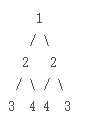

Given a binary tree, check whether it is a mirror of itself (ie, symmetric around its center).

For example, this binary tree [1,2,2,3,4,4,3] is symmetric:

But the following [1,2,2,null,3,null,3] is not:


可以用递归解决，首先判断当前检查的左右两个节点是否相等，然后判断左节点和右节点是否存在，如果只存在一边那么肯定不是成对的。如果左右两边都不存在那么当前递归判断已经到底返回true，否则就继续往下递归即可。
```Javascript
var isSymmetric = function(root) {
  if (!root) return true;
  if (!root.left && !root.right) return true;
  if (root.left && !root.right) return false;
  if (!root.left && root.right) return false;
  if (root.left.val !== root.right.val) return false;
  function checkNode(node1, node2) {
    if (!node1 && !node2) return true;
    if (node1 && !node2) return false;
    if (!node1 && node2) return false;
    if (node1.val !== node2.val) return false;
    return checkNode(node1.left, node2.right) && checkNode(node1.right, node2.left);
  }
  return checkNode(root.left, root.right);
};
```
也可以直接翻转左右两个节点递归判断是否相等：
```Javascript
var isSymmetric = function(root) {
    if (root == null) return true;
    function check(left_node, right_node) {
        if (left_node === null && right_node === null) return true;
        if (left_node === null) return false;
        if (right_node === null) return false;
        if (left_node.val != right_node.val) return false;
        // 翻转
        let t = right_node.left;
        right_node.left = right_node.right;
        right_node.right = t;
       
        return check(left_node.left, right_node.left) && check(left_node.right, right_node.right);
        
    }
    return check(root.left, root.right);
};
```
