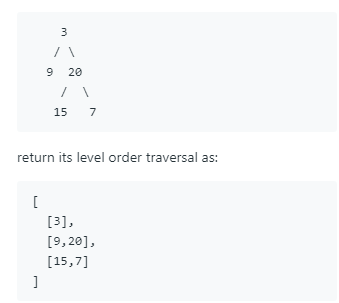

Given a binary tree, return the level order traversal of its nodes' values. (ie, from left to right, level by level).

For example:
Given binary tree [3,9,20,null,null,15,7],

这道题是层次遍历二叉树。具体的写法可以先建立一个数组，先依次遍历左节点并记录层次信息，将左节点所有的值和当前的层次放入到数组。再以同样的方式遍历右节点即可。

```Javascript
var levelOrder = function(root) {
  if (!root) return [];
  let rs = [];
  rs[0] = [[root.val]];
  function traversal(node, level) {
    if ((node.left || node.right) && !rs[level]) {
      rs[level] = [];
    }
    if (node.left) {
      rs[level].push(node.left.val);
      traversal(node.left, level + 1);
    }
    if (node.right) {
      rs[level].push(node.right.val);
      traversal(node.right, level + 1);
    }
  }
  traversal(root, 1);
  return rs;
};
```
