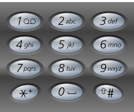

Example:

Input: "23"
Output: ["ad", "ae", "af", "bd", "be", "bf", "cd", "ce", "cf"].

题目意思需要把按过的按钮所组成的字母所有可能性都罗列一边。解法1是从后到前写出所有的组合。比如2，3，先把3所有的组合列出（d，e，f）然后用2的每个字母插入到3的每个组合里面去：[“ad”, “ae”, “af”, “bd”, “be”, “bf”, “cd”, “ce”, “cf”]。如果是234这样的组合，先把34所有的组合求出然后用2的每个字母插入到34的每个组合里面去。写代码的时候用一个数组保存一下求过的组合即可。
```javascript
var letterCombinations = function(digits) {
  let tmp = {};
  let currentDigits = '';
  if (!digits) return [];
  digits = digits.split('');
  let dict = {
    1: '*',
    2: 'abc',
    3: 'def',
    4: 'ghi',
    5: 'jkl',
    6: 'mno',
    7: 'pqrs',
    8: 'tuv',
    9: 'wxyz'
  }
  for (let i = digits.length - 1; i >=0; i --) {
    currentDigits = `${digits[i]}${currentDigits}`;
    if (currentDigits.length === 1) {
      tmp[currentDigits] = dict[currentDigits].split('');
    } else {
      // i遍历一遍当前数字，j遍历多次内部数字
      let chars =  dict[digits[i]].split(''); // 当前按钮字符数组
      tmp[currentDigits] = [];
      let prevDigits = currentDigits.slice(1, currentDigits.length); // 234取34的计算结果
      let prevChars = tmp[prevDigits];
      for (let i = 0; i < chars.length; i++) {
        for (let j = 0; j < prevChars.length; j++) {
           tmp[currentDigits].push(chars[i] + prevChars[j]);
        }
      }
    }
  }
  return tmp[currentDigits];
};
```