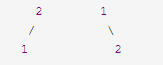
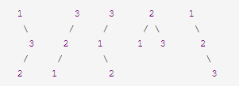

题目：Given n, how many structurally unique BST's (binary search trees) that store values 1...n?

For example,
Given n = 3, there are a total of 5 unique BST's.


如图求出1~n的时候有多少种搜索二叉树排列排列方式。这道题可以用DP解，分析题目，当n是0的时候，是一个空树，空树也是一种排列方式。n是1的时候，总共也是有一种排列，用DP数组来表示：
```javascript
dp[0]=1;
dp[1]=1;
```
如果n是2，那么他的排列方式为：

有两种排列方式，可以拆解为2为根的时候左数有1种排列方式，1为根的时候右树有一种排列方式。
```javascript
dp[2] = dp[1] * dp[0] + dp[0] * dp[1]
```

如果n是3，那么排列方式为：

组合的数量即左树下面计算过的所有组合数量x右树的下面计算过的所有组合数量。
```javascript
dp[3] = dp[2] * dp[0] + dp[1] * dp[1] + dp[0] * dp[2]
```
以此类推，写出代码：
```javascript
var numTrees = function(n) {
  let dp = new Array(n + 1).fill(0);
  dp[0] = 1; // 空树有一种组合
  dp[1] = 1; // 只有根节点也只有一种组合
  for (let i = 2; i <= n ; i++) {
    // 分别计算左子树和右子树各种情况的数量并相加
    for (let j = 0; j < i; j++) {
      dp[i] +=dp[i - j - 1] * dp[j];
    }
  }
  return dp[n];
};
```