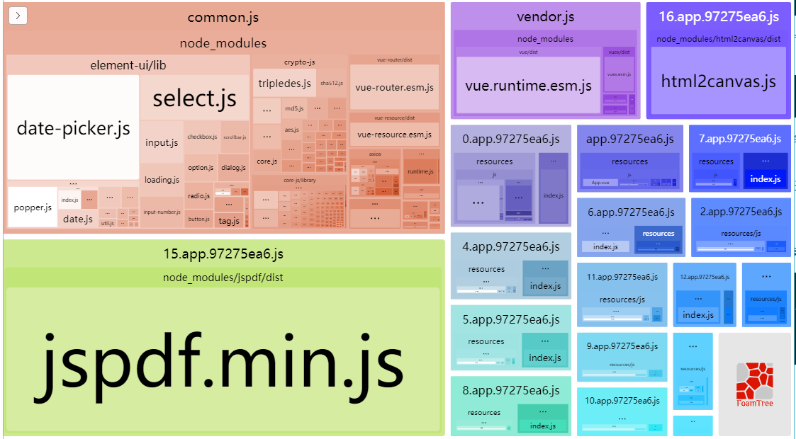
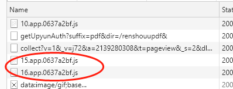

在项目中由于整体引入了element ui，最后打包出来的js比较大。在有些活动页面的内容考虑到对加载速度有一定要求，并且前端用于导出PDF的模块JSPDF比较大（几百k），不是每个页面都需要这个模块，决定缩小一下体积。

#### 路由配置
官方文档里路由提供了懒加载功能，直接在路由里配置：

```javascript
{
     path: '/someroutes',
     component: Vue.component('async-webpack-example', (resolve) => import('@/components/comp.vue')
     ),
     name: 'component'
}
```

import语法是新ES里动态加载模块，返回一个promise对象，加载完成的时候resolve一个加载完毕的模块对象。

但是如果封装成工厂函数
```javascript
function resolveImport(path) {
	 return Vue.component('async-webpack-example', (resolve) => import(path)
     ),
}
```
这样是不行的。由于webpack实现该语法会收集所有模块进行单独打包，它把括号传入参数替换为一个正则：
```javascript
	import('./app'+path+'/util') => /^\.\/app.*\/util$/
```

也就是说，import参数中的所有变量，都会被替换为【.*】，而webpack就根据这个正则，查找所有符合条件的包，将其作为package进行打包。

那么最好还是直接传参数，避免变量和表达式。

#### 模块懒加载
很简单，按照import()语法，在需要调用模块的地方写个同步加载:
```javascript
...somecode
let Jspdf = await import('jspdf');
let jspdf = new Jspdf(...)
...somecode
```
看一下打包出来结果：


这模块占了一大块体积，等到页面需要调用JSPDF模块的时候，会通过ajax自动下载该模块通过jsonp运行，完成后再执行后续代码。


路由页面文件经过处理以后也是一样的，被拆成 [数字].app.js ，当路由加载到页面的时候才加载，减少了一大半首屏加载体积。