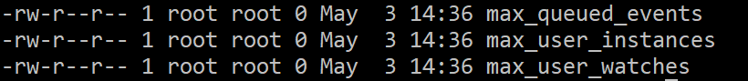

inotify是linux自带的一个高效的检测文件实时改动的一个api，inotify-tools将这个接口进行了包装，当文件有改动的时候可以触发一些操作（一般是脚本），再借助rsync命令可以实现即时文件远程同步功能，方便的实现本地开发远程调试。

借由inotify + rsync命令可以方便的实现本地进行代码开发，然后将实时同步到远端服务器上面，方便查看效果。我这里是想通过这种方式实现在国外vps实时调试后端，因为有些api需要梯子，再加上平时出门会使用surface go调试代码，本地环境搭建不是很方便。

首先先检查一下内核是否支持inotify：
`ls -l /proc/sys/fs/inotify/ `
要是像下图那样列出三条记录那么就是支持的


<!-- more -->

#### 安装：
```
wget https://jaist.dl.sourceforge.net/project/inotify-tools/inotify-tools/3.13/inotify-tools-3.13.tar.gz
tar xf inotify-tools-3.13.tar.gz
./configure --prefix=/usr/local/inotify-tools-3.13 && make && make install
```
使用inotifywait可以用阻塞的方式监听文件改动的方式，典型的几个选项：
```
-h 或 --help 显示帮助

    @<file> Exclude the specified file from being watched.

    --exclude <pattern> 指定排除(忽略)部分文件或目录，这些文件或目录上不监听任何事件，正则表达式书写(相对路径)
      FMT: # --exclude 'Runtime' //忽略对Runtime目录的事件监听

    --excludei <pattern> 与--exclude相同，区别是此选项正则表达式忽略大小写

    -m 或 --monitor 持续保持监听(如果不加此选项，则监听到一次后便退出)

    -d 或 --daemon 以守护进程方式后台运行(除了在后台运行外，与-m选项一样)

    -r 或 --recursive 递归监听其下所有子目录及文件

    --fromfile <file> Read files to watch from <file> or `-' for stdin.

    -o 或 --outfile <file> 将事件输出到指定文件，而不输出到屏幕
      FMT: -o /var/log/inotifywait.log

    -s 或 --syslog 将错误发送到系统日志，而不是输出到屏幕

    -q 或 --quiet 打印较少信息(仅打印事件)

    -qq 不打印任何信息(静默方式)

    --format <fmt> 设置打印屏幕的格式，常见选项：%T时间；%w触发事件文件所在绝对路径；%f触发事件文件名称；%e触发的事件名称；
      FMT: # --format '%T %f %e' 

    --timefmt <fmt> 指定输出时间内容，相当于将时间赋值给%T
      FMT: # --timefmt '%y-%m-%d %H:%M'

    -c 或 --csv 用CSV格式打印事件

    -t 或 --timeout <seconds> 指定一次性监听时间，超时退出监听(值为0表示永不超时，单位:秒)，不可与 -m -d 连用
      FMT: # -t 60 //设定监听60秒，60秒内监听到事件立即退出，如果监听不到事件60秒后也退出

    -e 或 --event <event1> [ -e|--event <event2> ... ] 指定要监听的事件(多个事件用逗号分割)
      FMT: # -e 'create,delete,close_write,attrib,moved_to'
```

其实具体使用的方式很简单，命令加上路径即可，有文件改动的时候会将触发的文件目录，事件类型等输出到标准输出流当中，再结合管道命令去做一些事情（一般就是运行脚本），脚本如下：

```
#!/bin/bash

inotify=inotifywait
do
$inotify -mrq --timefmt '%d/%m/%y %H:%M' --format '%T %w%f %e' --exclude '.*/.idea.*|.*___jb_tmp___|.*___jb_old___'  -e create,modify,delete,close_write ${1} | while read LINE
do
 echo ${LINE}
done
```

监听${1}文件夹里的所有改动，并且通过管道命令循环读取并且echo出来。
第一次使用这个脚本有效果，但是有个问题，IDE使用的时候并不是简单修改文件，jetbrain的编辑器会执行诸如先把修改过的文件先保存一份临时文件再移动回来这样的操作，这样就导致编辑一个文件触发了很多inotify事件（意味着如果执行sh脚本会执行很多次）。几经思考，发现如果把m参数去掉（持续监听），那么其实监听到一次改动就立刻退出了。这个时候把脚本写成死循环的形式，执行一次就退出再执行一次别的命令（rsync同步）并且继续循环再次执行inotify命令，就能满足需求了。

```
#!/bin/bash

inotify=inotifywait
while :
do
$inotify -rq --timefmt '%d/%m/%y %H:%M' --format '%T %w%f %e' --exclude '.*/.idea.*|.*___jb_tmp___|.*___jb_old___'  -e create,modify,delete,close_write ${1} | while read LINE
do
 echo ${LINE}
done
echo get modify!!!, run ${2}
#这里执行脚本
bash ${2}
done
```