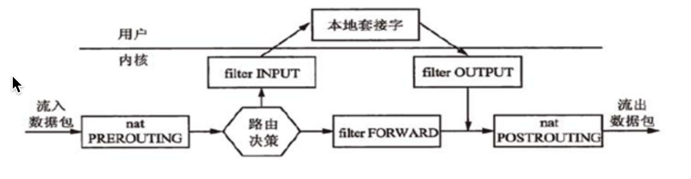
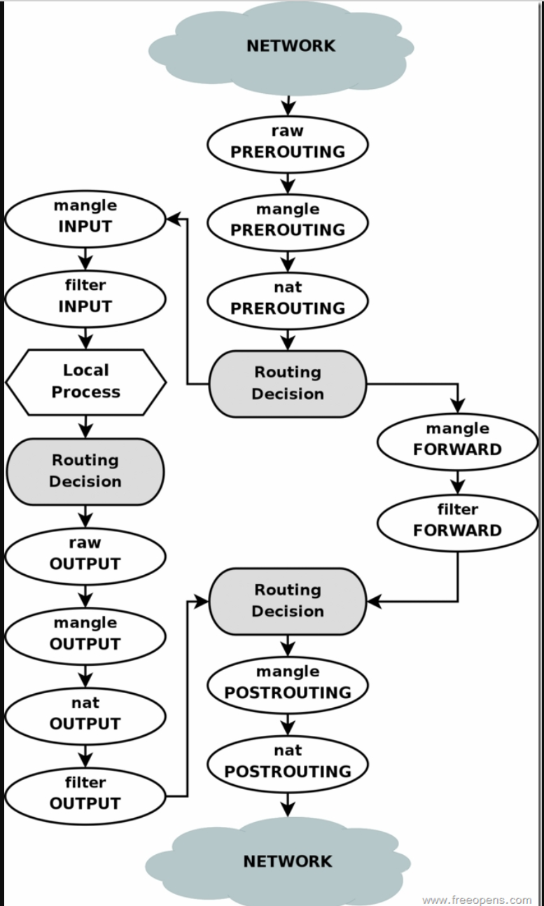

自从家里PC改造为esxi平台以后，发现原本的移动宽带满足不了自己的需求，一个是缺少公网IP（虽然有v6），另一个是晚上梯子的速度是越来越慢了，晚上八九点几乎是没什么速度。在这个背景下，看到了电信有360一年20M的套餐，并且前三个月有免费提速100m的活动，想着就办一个吧。
师傅装完宽带，发现如自己预期拿到了公网IPv4，虽然是动态的，访问不了443，80这些端口，但是想着配合DDNS搭建一个自己测试服务器平台，访问一下家里虚拟机资源啥的还是妥妥的。由于移动的宽带还在，于是找了根网线电信光猫LAN口插移动光猫LAN口。这样就可以有两个网关使用了。但是之后奇怪的问题发生了，虚拟机三个IP+树莓派一个IP，有些设备即使正确配置了电信内网网关IP但却上不了网，一开始寻思难道我子网掩码什么的配置有问题，但是网关地址改成移动却都是正常的，后来上网搜索才发现电信光猫默认限制了8个设备，而在设置主页里面有十几个IP。家里设备IP比较多，主要是米家智能家居全家桶占了很多个IP。凭啥就给我限制8个设备呢？于是决定破解电信光猫。
网上搜索了一番，F450G有两个版本，useradmin账号进入光猫，设备显示的V2.0.0P1T1sh，T后面是1不是2就可以用下面的方法，2的话就得拆机接TTL破解telnet访问了。运气比较好手里的版本是1，所以只需要简单的重置设备telnet连上去就可以改造了。

#### 破解连接数，改光猫默认路由模式到桥接模式

```
0、登录useradmin后先记下宽带识别号！！！电信路由器是先通过宽带识别号注册光猫设备，然后会通过LOID下发pppoe用户名密码这些。我这里pppoe用户名就是办理宽带送的手机卡的号码，密码我是打10000问的。
1、拔掉光纤后，通过http://192.168.1.1/return2factory.html恢复真正的出厂设置，只用登陆界面的恢复出厂设置按钮是不能清除设备注册信息的，或者你可以直接捅菊花reset
2、等光猫重启后telnet进光猫，用户名root，密码Zte521
3、以下命令都要在输入后，都要使用以下命令保存配置

sendcmd 1 DB save
sendcmd 1 DB reboot

4、sendcmd 1 DB set TelnetCfg 0 Lan_EnableAfterOlt 1     插上光纤后不自动关闭telnet

5、sendcmd 1 DB set TelnetCfg 0 Max_Con_Num 5     最多能够登录5个用户，避免被锁死

6、破解打开网页自动跳转LOID注册页面
sendcmd 1 DB set PDTCTUSERINFO 0 Status 0
sendcmd 1 DB set PDTCTUSERINFO 0 Result 1

7、sendcmd 1 DB set CltLmt 8 Enable 0    直接关闭限制最大用户数

8、查看telecomadmin帐号的密码
sendcmd 1 DB p DevAuthInfo

9、重启光猫，进192.168.1.1的页面，点设备注册，输入宽带识别号后点下一步，完成设备注册！！！

10、再次telnet进光猫，禁用电信远程控制（此项必须在以上步骤完成后进行！！！切记！！！否则无法注册LOID成功！）
sendcmd 1 DB set MgtServer 0 URL http://127.0.0.1
sendcmd 1 DB set MgtServer 0 PeriodicInformEnable 0
sendcmd 1 DB set MgtServer 0 Tr069Enable 0

11、用telecomadmin的密码进192.168.1.1的页面，把“网络-网络设置”里连接名称带internet字样（下拉可见）的配置删除，再“新建wan连接”，直接把连接模式从“路由”改成“桥接”就点最下面的“添加”，再点“保存”，重启光猫完工！
```
<!-- more -->
经过这波操作以后连接数不是问题了，然后拨号改成了桥接模式，电信光猫此时就变成了二层光纤转网线交换机，ppp拨号适配就可以放在树莓派里了，也就是说树莓派此时可以作为局域网的一个网关。

#### 设置树莓派PPPOE网关
**安装PPPOE有关包**
`sudo apt-get install pppoe pppoeconf pppstatus`
**配置PPPOE**
运行`pppoeconf`，会弹出一个对话框，其中要求PPPOE的账号和密码，输入即可，其他一路默认OK。
**查看是否拨号成功**
拨号成功的话，运行`ifconfig`会出现一个ppp0的设备，其中inet就是你的公网ip。
**配置NAT**
此时树莓派已经可以上网了，但是还不能作为网关。要作为网关必须为局域网的设备提供地址转换服务，把经过网关的数据包内网IP地址改写成公网IP地址再发送出去，这样数据包才能顺利到达远程主机并且能按原路返回。用到的工具就是iptables。

iptables有五个链：**PREROUTING,INPUT,FORWARD,OUTPUT,POSTROUTING**

* PREROUTING:数据包进入路由表之前
* INPUT:通过路由表后目的地为本机
* FORWARDING:通过路由表后，目的地不为本机
* OUTPUT:由本机产生，向外转发
* POSTROUTIONG:发送到网卡接口之前。


图里路由决策简单来说所有目标IP是本机的进入INPUT，否则进入FORWARD链。
要达到网关的目的在POSTROUTING添加一条规则，即所有出站的IP包源地址都改成pppoe上面获取的公网地址。可以使用命令：
`iptables-t nat -A POSTROUTING -s 192.168.1.0/24 -o ppp0 -j SNAT --to-source xx.xx.xx.xx`
但是SNAT方法有个缺点，必须明确指定--to-source pppoe获取的公网IP，pppoe拨号时每次获得的公网ip是变化的，有没有办法自动获得pppoe获取的IP呢，这个时候可以使用MASQUERADE：
`iptables -t nat -A POSTROUTING -s 192.168.1.0/24 -o ppp0 -j MASQUERADE`
MASQUERADE就是针对这种场景而设计的，他的作用是，从-o指定的interface上，自动获取当前ip地址来做NAT。

iptables重启不会自动加载当前的配置的，所以设置好以后需要保存当前配置文件，使用命令`iptables-save > ~/gateway.conf`，开机脚本中再添加`iptables-restore < /root/gateway.conf`就能自动加载iptables的配置了。

补充：有时候会出现network unreachable的情况，这个时候检查一下路由表是否有一条默认指向ppp0的路由

如果没有，添加命令为：`route add -net 0.0.0.0 ppp0`
建议在每次ppp拨号成功的时候就添加默认路由，在`/etc/ppp/ip-up`中添加`route add -net 0.0.0.0 ppp0`
路由表详解：https://blog.csdn.net/kikajack/article/details/80457841

ppp拨号命令：`pon dsl-provider`
断开命令 `poff`

#### iptables一些命令补充记录：
iptables -L -n --line-number 查看所有进出站规则 
iptables -t nat -F 清空某个表所有规则
iptables -D INPUT 3 删除指定链规则
iptables -A INPUT -p tcp -s 127.0.0.1 --dport 8881 -j ACCEPT 允许127.0.0.1访问8881
iptables -A  INPUT -p tcp --dport 8881 -j （ACCEPT/DROP） 允许/禁止访问8881端口
iptables -t nat -A POSTROUTING -s 192.168.1.0/24 -o ppp0 -j MASQUERADE nat转发
iptables -t mangle -A V2RAY -d 124.79.0.0/16 -p udp -j RETURN 中止某个网段继续向下匹配规则（一般用于直连）

iptables各个表的优先级顺序：
MANGLE->NAT->FILTER
iptables匹配顺序：

